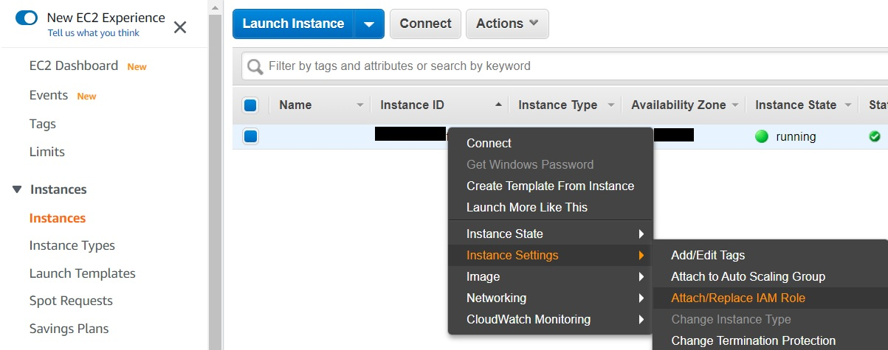
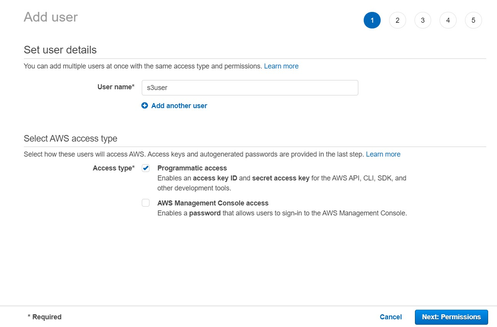
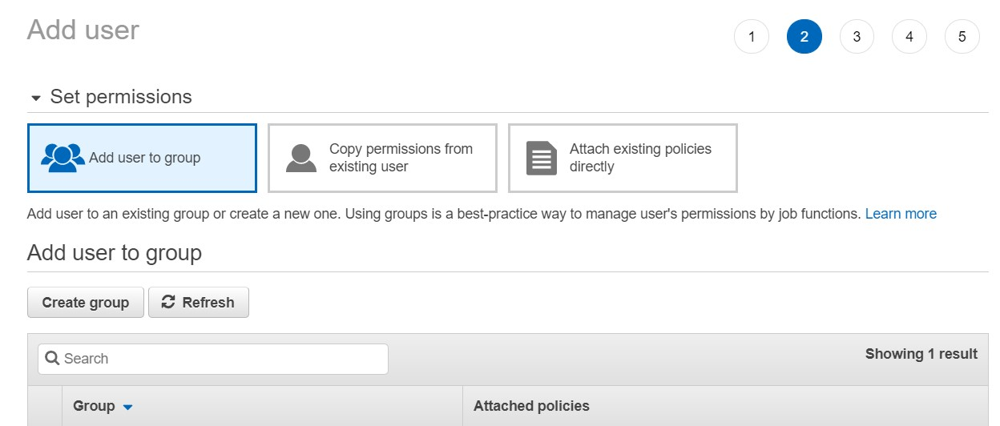

Got a crash course in working with Amazon Web Services today.

### What I was trying to do
Scale up a text processing project by moving to AWS. The scale-up will need an estimated 100 GB of storage, and an unknown amount of computing power.

### What I Did

#### 1. Create a new EC2 instance

EC2 stands for Elastic Compute Cloud and provides pay-as-you-go virtual computing environments. There are [a ton of features](https://docs.aws.amazon.com/AWSEC2/latest/UserGuide/concepts.html), but the main ones to pay attention to for now are:
- the **instance type**, which defines the CPU, memory, storage, and networking capacities of the virtual machine;
- the **Amazon Machine Image (AMI)**, which is a template for the operating system and additional software the instance should start out with;
- and storage options for the virtual machine. **Instance store volumes** provide temporary storage that gets deleted when the instance is stopped (i.e., shut down) or terminated (i.e., deleted). Amazon **Elastic Block Store (EBS)** volumes provide persistent storage -- they're like the hard drive on a physical computer.

Creating an instance, then, still entails several decisions, even before getting to the software installation stage.

Thankfully, Louis Aslett has simplified the process by creating [RStudio Server AMIs](https://www.louisaslett.com/RStudio_AMI/). We still have to choose an instance type, but the image features 20 GB default EBS and includes a ton of useful software. 


##### Bonus Failure Notes

I initially tried configuring everything from scratch, following the Longer, Detailed Way steps in [Jagger Villalobos's tutorial](https://jagg19.github.io/2019/08/aws-r/). It's a great tutorial, but the long way turned into a time-consuming headache for me for two reasons. First, the tutorial assumes you're using a UNIX-like operating system to work with the EC2 instance. While the instance is a virtual computer, we still need to access it with an actual machine. Leaving access unregulated is a bad idea, which is where key pairs come in. The EC2 instance stores the public key, and the corresponding private key is needed to log in. Key management is different in Windows than in Linux and Mac OS. I eventually figured out [how to connect with PuTTY](https://docs.aws.amazon.com/AWSEC2/latest/UserGuide/putty.html). 

In retrospect, I should have sucked it up and updated my Windows Subsystem for Linux, but I still would have hit the next hurdle. I unwittingly chose the Amazon Linux AMI, which uses yum as its package manager. The commands to download R, RStudio, and other software are written for a machine running Ubuntu or Debian, which use apt-get instead of yum. The commands are different between the package managers. I'd like to be fluent in both, but today is not the day to accomplish that.

#### 2. Create an S3 bucket

S3 stands for Simple Storage Service and is exactly what it says -- simple, web-based object storage. EC2 instances come with persistent storage in the form of EBS volumes. Why create an S3 bucket then? One, S3 storage is cheaper. Two, files in an S3 bucket can be accessed by multiple computers (even physical, non-AWS-hosted ones), whereas an EBS volume is mounted to one EC2 instance at a time. This means that it's possible for different people on different machines to work wiht the data. ([See here](https://dzone.com/articles/confused-by-aws-storage-options-s3-ebs-amp-efs-explained) for a table comparing different AWS storage options and [here](https://www.missioncloud.com/blog/resource-amazon-ebs-vs-efs-vs-s3-picking-the-best-aws-storage-option-for-your-business) for another comparison of use cases).

Creating the bucket itself was the most straightforward part of the process -- it's just a wizard. I chose to encrypt objects automatically with AES-256, and kept the default option to block all public access. One thing worth noting is that access requests should be logged to a different bucket. 

#### 3. Set up an IAM policy

Even though all the data I plan on hosting is publicly available, it's worth getting in the habit of securing S3 buckets. To do this, I set up an [Identity and Access Management (IAM)](https://console.aws.amazon.com/iam/home) policy and role, then attached the role to my EC2 instance.

First, the policy. Amazon offers several policies out of the box, but I wanted one that restricted access to just the bucket where project data will be stored. The policy below isn't perfect, but it's a workable first iteration that does what I need it to do. It was modified from the policy [in this old AWS blog post](https://aws.amazon.com/blogs/big-data/running-r-on-aws/), which unfortunately got me an error when I tried to use it to access my S3 bucket from RStudio Server.

```json
{
    "Version": "2012-10-17",
    "Statement": [
        {
            "Effect": "Allow",
            "Action": [
                "s3:GetBucketLocation",
                "s3:ListAllMyBuckets"
            ],
            "Resource": [
                "arn:aws:s3:::*"
            ]
        },
        {
            "Effect": "Allow",
            "Action": [
                "s3:*"
            ],
            "Resource": [
                "arn:aws:s3:::mybucket",
                "arn:aws:s3:::mybucket/*"
            ]
        }
    ]
}
```
Then, I created the role, which is a straightforward, wizard-driven process. Finally, I attached the role to the EC2 instance by right-clicking and assigning the role.



##### Alt Route with Users and Groups

An alternative to creating a role is to create a user with programmatic access. This generates an access key ID and secret access key that can be used with various AWS tools, including to access S3 via our scripts. Going this route enables S3 access from other machines besides our EC2 instance.



The second screen lets us add the user to a group to which IAM policies are attached. While it's best practice to manage permissions on a group basis, it is possible to attach policies directly.



The rest of the wizard can be stepped through. Access keys can be generated from the IAM console -- click on the user name, then the Security credentials tab.


#### 4. Configure RStudio Server

After all this, it's still not quite done. The AMI comes loaded with RStudio and packages like the tidyverse, but a few more libraries are needed to be able to access the S3 bucket.

`aws.s3` provides a way to access buckets and read and save objects to them.

The bucket isn't public, so I also need a way to pass credentials. There are a couple of ways to do this.

Since I set up an IAM role and attached it to the EC2 instance, the easiest way to ensure access to the S3 bucket is by installing the `aws.ec2metadata` package. There's no need to load the library once it's installed -- it just needs to be installed to work. 

```r
install.packages("aws.s3", "aws.ec2metadata")
library(aws.s3)

# confirm access
bucketlist()
```

The policy I set up makes all S3 buckets visible, even if the EC2 instance doesn't have read/write access, so not every bucket name returned can actually be accessed.

##### An alternative method
Going the alt route and managing access with users, groups, and keys (instead of with roles), access details can be added to the `.Renviron` file. `usethis` provides a way to modify the `.Renviron`. `devtools` is a prerequisite for `usethis`.

```r
install.packages("devtools")
install.packages("usethis")

# edit the environment file
usethis::edit_r_environ()
```

Update `.Renviron` accordingly, save and restart the R session. For the East Coast, the default region is probably "us-east-2".

```r
AWS_ACCESS_KEY_ID = "your-key-here"
AWS_SECRET_ACCESS_KEY = "your-secret-here"
AWS_DEFAULT_REGION = "region-here"
```


#### 5. Access the bucket from RStudio

If all goes well, we should be able to see a list of accessible buckets with `aws.s3::bucketlist()`, and view the contents of a bucket with `aws.s3::get_bucket("bucket_name")`

```r
library(aws.s3)

# confirm access
bucketlist()

# check out bucket contents
get_bucket("mybucket")

# load a csv in the bucket to a data frame
counts <- s3read_using(read.csv, 
                       object = "counts.csv", 
                       bucket = "mybucket")
```


#### n. Connect the GitHub Repo

We still have to bring in the actual project code. This process is the same on the EC2 RStudio Server instance as it is on RStudio desktop, thankfully.
